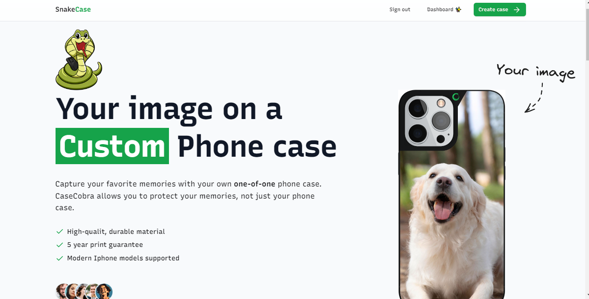
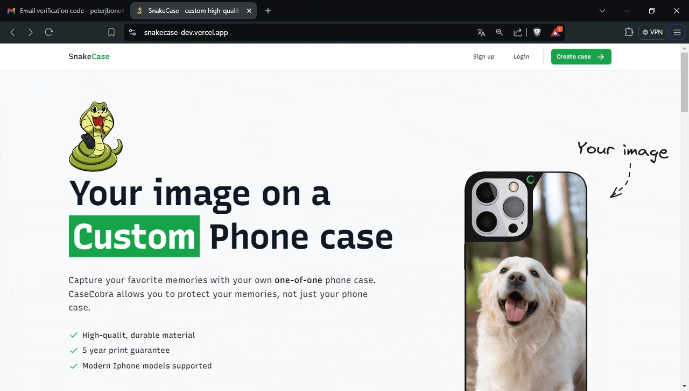

# Snake Case 🐍

A Modern E-Commerce-Store for Custom Phone Cases (Drag & Drop)

**Deployment**: [Snake Case 🐍](https://snakecase-dev.vercel.app/)



## Features 👀

- 🛠️ Complete shop built from scratch in Next.js 14
- 💻 Beautiful landing page
- 💳 Admin dashboard to manage orders
- 🖥️ Drag-and-drop file uploads
- 🛍️ Customers can purchase directly from you
- 🌟 UI components from shadcn-ui
- 🛒 Completely custom phone case configurator
- 🔑 Authentication using Kinde
- ⌨️ 100% written in TypeScript

## Captures of the Website 🎥

### Login



### Landing page


### Custom Phone case configurator


### Purchase with stripe

### Admin Dashboard

## Installation

Clone the project

```bash
git clone https://github.com/peterjbone/snakecase.git
```

Install the dependencies

```bash
npm install
```

Set the database with prisma

```bash
npx prisma db push
```

### Set the environment variables

- KINDE_CLIENT_ID
- KINDE_CLIENT_SECRET
- KINDE_ISSUER_URL
- KINDE_SITE_URL
- KINDE_POST_LOGOUT_REDIRECT_URL
- KINDE_POST_LOGIN_REDIRECT_URL
- ADMIN_EMAIL
- UPLOADTHING_SECRET
- UPLOADTHING_APP_ID
- DATABASE_URL
- STRIPE_SECRET_KEY
- STRIPE_WEBHOOK_SECRET
- NEXT_PUBLIC_SERVER_URL
- RESEND_API_KEY

## Tech

- [Next.js](https://nextjs.org/) (framework)
- [Typescript](https://www.typescriptlang.org/)
- [Neon Tech](https://neon.tech/) (SQL)
- [Prisma](https://www.prisma.io/) (ORM)
- [Stripe](https://stripe.com/) (payment)
- [Uploadthing](https://uploadthing.com/) (Cloud)
- [Kinde](https://kinde.com/) (Auth)

## License

[MIT](https://choosealicense.com/licenses/mit/)
